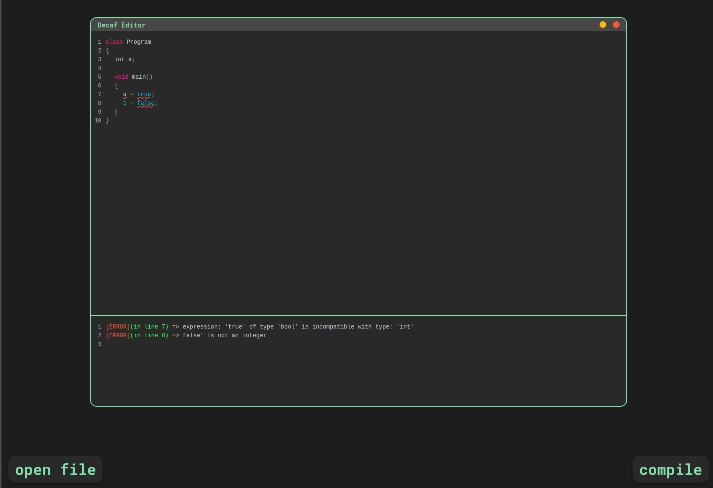

# Decaf Compiler
- Universidad del Valle de Guatemala
- Course: Compiler Construction
- Sebastian Arriola Bethanourt - 11463

## Description
- Repository for a Decaf compiler that will be constructed for our university course.

## Requirements to Test the Project
- python3
- nodejs
- npm

## Instructions to Test the Project
1. `git clone git@github.com:sebdeveloper6952/decaf-compiler.git` 
2. `cd decaf-compiler`
3. to install the server dependencies `cd decaf-server`
4. `python3 -m venv venv && ./venv/bin/pip install -r requirements.txt`
5. to install the editor dependencies `cd decaf-editor`
6. `npm install`
7. Open two terminals, one in `decaf-server` and the other one in `decaf-editor`.
8. On `decaf-server` run `chmod +x ./run_server.sh && ./run_server.sh`.
9. On `decaf-editor` run `npm run serve`.
10. Open a web browser in `localhost:8080` and you should see the Decaf Editor.
11. Write a Decaf program or open a text file and click the compile button.
